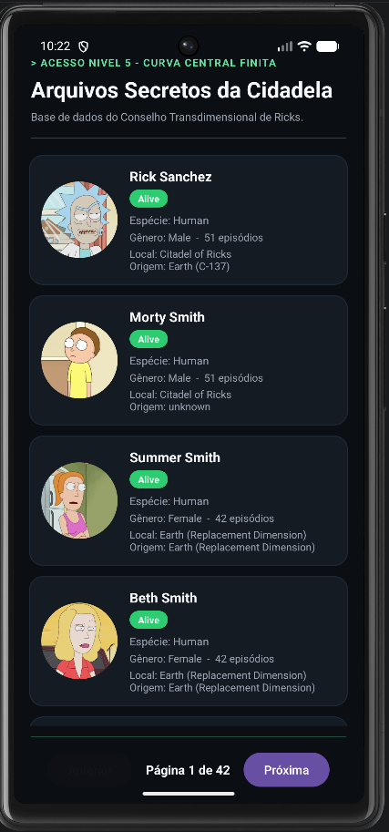

# Rick and Morty API - Client Android

Aplicativo Android desenvolvido em Java para consulta e visualização dos dados de personagens da API pública de [Rick and Morty](https://rickandmortyapi.com/).

O projeto foi estruturado seguindo boas práticas de separação de responsabilidades como Repository Pattern, com tratamento de concorrência, suporte a paginação de resultados e renderização dinâmica de listas.

---

<p align="center">
  
</p>

---

## Arquitetura e Estrutura

O código é organizado em camadas claras para facilitar manutenção e testabilidade:

```text
com.devLucasRamos.RickMortyAPI
├── data
│   ├── model
│   │   ├── Character.java
│   │   └── CharacterResponse.java
│   ├── remote
│   │   ├── ApiService.java
│   │   └── RetrofitClient.java
│   └── repository
│       └── CharacterRepository.java
└── ui
    ├── adapter
    │   └── CharacterAdapter.java
    └── MainActivity.java
```

---

## Tecnologias Utilizadas

- **Linguagem:** Java 11+
- **Comunicação HTTP:** Retrofit 2 + Gson Converter
- **Carregamento de Imagens:** Glide
- **Componentes Android:** RecyclerView, ConstraintLayout, ContextCompat, ViewCompat

## Como Executar

### Pré-requisitos
- Android Studio (versão Cinnamon Bun ou superior).
- Android SDK configurado com suporte ao Android 17 (API 37.1).
- Dispositivo Físico ou Emulador Android (API 37.1).
- Conexão ativa com a Internet.

### Passos
1. Clone o repositório:
   ```bash
   git clone https://github.com/devLucasRamos/RickMortyAPI.git
   ```
2. Abra a pasta do projeto no Android Studio.
3. Aguarde a sincronização das dependências do Gradle.
4. Certifique-se de que a permissão de internet está presente em `AndroidManifest.xml`:
   ```xml
   <uses-permission android:name="android.permission.INTERNET" />
   ```
5. Selecione o emulador ou dispositivo físico e execute a aplicação.